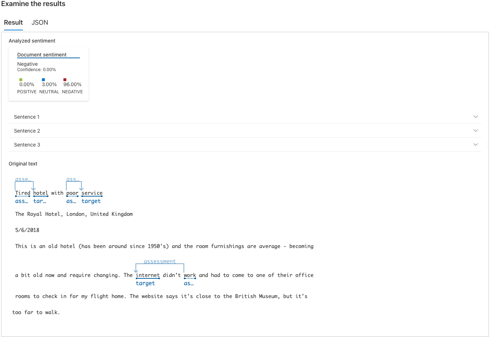
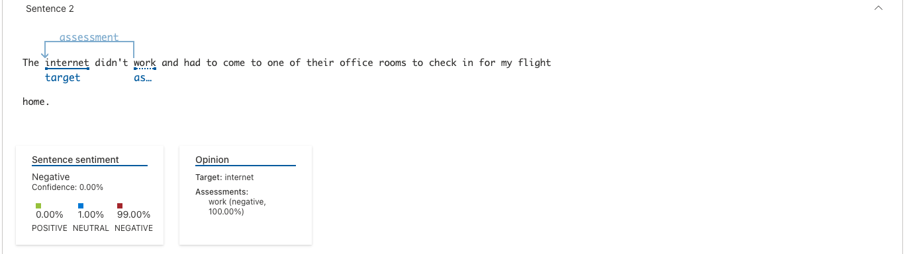
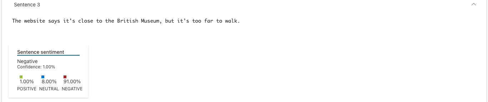

# LAB 3 - Sentiment Analysis With Language Studio On Azure AI

## Analyzing reviews in Language Studio

<table>
  <thead>
    <tr align="left">
      <th>#</th>
      <th>Steps</th>
    </tr>
  </thead>
  <tbody align="left">
    <tr>
      <td>01</td>
      <td>Create a Language resource</td>
    </tr>
    <tr>
      <td>02</td>
      <td>Configure the resource in Azure AI Language Studio</td>
    </tr>
    <tr>
      <td>03</td>
      <td>Analyze reviews in Language Studio</td>
    </tr>
    <tr>
      <td>04</td>
      <td>Clean-up</td>
    </tr>
  </tbody>
  <tfoot></tfoot>
</table>

## Results - Analisando sentimentos e opniões

### Overall sentiment

##

### Sentencia #1

##

### Sentencia #2

##

### Sentencia #3

##
